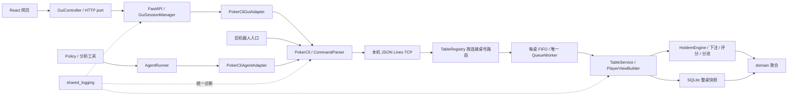

# 德州扑克模拟器：工程规范与运行指南

版本 1.1，2026-10-08。本文件是项目工程规范的总入口，集中维护需求、模块边界、运行方式、验收和范围。[Policy 接口参考](src/poker/agent/README.md)详细说明策略扩展契约。[公开验收摘要](docs/VALIDATION.json)保留工程结论；原始 JSON 回执、SQLite、JSONL 和截图作为本地验收数据归档；实际类型与唯一的 [日志 schema](src/shared_logging/event.schema.json) 执行字段契约。

**E01–E06、C01、I01、G01–G05、L01–L04、A01–A04、M01、N01、R01 已交付。** 项目提供服务端权威的无限注德州、自动轮询 CLI、可玩的 Web GUI、可替换 Policy 的独立 Agent 运行入口和统一结构化日志。一个游戏服务进程和 TCP 端口通过 TableRegistry 管理多个独立 TableRuntime，网页入口支持真实 / 虚拟局域网访问。ABC 中的抽象方法定义可替换角色；模型供应商、求解器和训练算法通过扩展接口接入。

[Agent 研究笔记](docs/AGENT_RESEARCH.md)按问题、策略表示、学术成果、实验方法整理前期调研，是非规范性研究资料。框架交付证明接入与运行可靠性；策略竞技水平需要另行评测。

## 1. 安装与启动

需要 Python 3.12+ 和 Node.js。前端依赖由 package-lock.json 固定，日志后端固定为 structlog==26.1.0。在仓库根目录执行：

```powershell
py -3.12 -m venv .venv
.\.venv\Scripts\python.exe -m pip install -e '.[dev,gui]'
Push-Location src/poker/gui/web
npm.cmd ci
npm.cmd run build
Pop-Location
```

在各运行终端中设置相同的运行 ID，将所有进程日志归入同一目录：

```powershell
$env:APP_RUN_ID = 'local-table'
$env:APP_LOG_DIR = '.data/logs'
$env:LOG_LEVEL = 'INFO'
```

先启动游戏服，再启动网页桥接，各自在独立终端运行，工作目录为仓库根目录：

```powershell
.\.venv\Scripts\poker-server.exe --port 8765 --db .data/poker.sqlite3 --table 1001 --table 1002
.\.venv\Scripts\poker-gui-bridge.exe --port 8770 --game-port 8765
```

浏览器访问 `http://127.0.0.1:8770`，输入桌号 1001 或 1002 和姓名入座；桌号留空进入默认桌。所有桌共用同一个网页桥接入口。其他玩家可以打开另一网页会话，或另开 CLI 终端：

```powershell
.\.venv\Scripts\poker-client.exe --port 8765 --table 1001
```

CLI 输入 `join 甲`。至少两名有筹码玩家入座后，任意已入座玩家输入 `start` 或点击网页“开始下一手”。随后按服务器提供的合法动作操作。网页和 CLI 共用原解析器、TCP、队列和引擎。所有筹码都是本地模拟器的整数虚拟筹码。

`--table` 在游戏服启动时可重复指定，配置活动桌号；第一张是默认桌。省略所有桌号参数时，仍创建一张随机 UUID 桌，兼容原单桌用法。桌号为 1–64 个字母、数字、下划线或连字符。CLI 可用 `join_table 1002 甲` 明确选桌；Agent 和被动机器人入口均支持 `--table 1002`。未知桌号拒绝入座，已入座连接不能改桌，换桌使用新连接。

游戏进程只有一个监听 socket，TableRuntime 不创建网络端口。每桌拥有 TableService、命令队列和唯一消费者，SQLite 文件按 table_id 分行保存。既有网页桥接是客户端入口，仍使用 8770；所有桌共用它，不为每桌启动桥接。

开发前端时，在 web 目录执行 `npm.cmd run dev`，访问 5173；Vite 将 `/api/gui` 转发至 8770。生产构建清空旧 bundle，桥接直接提供 dist/index.html 和 /assets。生产资源、SQLite schema 和日志 schema 均包含在 Python wheel 中；`--assets-dir` 可指定另一份已构建资源。修改前端后重新构建并刷新页面。

### 1.1 局域网 / 虚拟局域网联机

同学使用浏览器联机时，主机运行两个进程即可：游戏服与网页桥接。完成首次安装和前端构建后，在两个终端分别执行：

```powershell
.\.venv\Scripts\poker-server.exe --port 8765 --db .data/poker.sqlite3 --table 1001 --table 1002
```

```powershell
.\.venv\Scripts\poker-gui-bridge.exe --host 0.0.0.0 --port 8770 --game-port 8765
```

将 `http://<主机的局域网或虚拟局域网 IPv4>:8770` 发给同学，双方输入相同桌号和各自姓名。`0.0.0.0` 是监听所有 IPv4 网卡的参数，分享链接必须换成同学可达的主机 IP。同学无需安装 Python、Node.js 或代码仓库。网页、静态资源与 `/api/gui` 使用同一来源，多个浏览器会话和所有牌桌共用 8770。

[Tailscale](https://tailscale.com/docs/concepts/ip-and-dns-addresses?tab=windows) 和 [EasyTier](https://www.easytier.cn/guide/network/quick-networking.html) 都可提供这里所需的虚拟局域网；网络搭建由所选工具完成。两端应已加入同一网络并能访问主机虚拟 IP。EasyTier 使用相同的网络名和密钥加入；实际可达性还取决于节点连接与网络策略。可把 `--host 0.0.0.0` 换成主机虚拟 IP，只监听该接口。

桥接默认 `--host 127.0.0.1`，游戏 TCP 始终使用本机 8765；只需让同学可达网页 8770。如 Windows 防火墙阻止入站，允许所用网络接口上的 TCP 8770。当前入口按可信局域网使用，没有账号认证或 TLS；此步骤不需要公网端口映射。断线和刷新行为仍按第 8 节执行。

本分支 `experiment` 在 `main` 的多桌与局域网工程上加入 [ReAct Agent](src/poker/agent/react/README.md)：模型循环、策略引导、记忆、分析工具和可替换后端。原策略接口通过 DecisionEngine 兼容，机械基线仍可运行。

## 2. 需求与交付映射

| 工作段 | 必须交付的行为 | 实现与验收 |
|---|---|---|
| E01 | 2–6 人开局、盲位轮转、短码盲注、两轮底牌 | HoldemEngine.start_hand；test_start_hand.py |
| E02 | 无限注、精确跟注、最低加注、逐人重开权限 | NoLimitBettingRules；test_betting.py |
| E03 | 大盲机会、换街与烧牌、全下发完、无人争夺 | HoldemEngine._advance_until_waiting；test_advancement.py |
| E04 | 九类五张牌值、踢脚牌、A2345、最佳组合 | FiveCardHighEvaluator；test_evaluator.py |
| E05 | 无人跟注退款、累计分层、弃牌贡献与资格 | SidePotAllocator；test_pots.py |
| E06 | 各池独立赢家、平局余数、一次支付与守恒 | test_settlement.py、四项规则验收、150 手固定种子回归 |
| C01 | 自动查询、单连接所有权、安全视图呈现 | PokerCli.run；test_polling.py 与真实 CLI 验收 |
| I01 | 游戏服与三个安装后的 CLI 连续多手 | verify_local_game.py；[公开验收摘要](docs/VALIDATION.json) |
| G01 | React / TypeScript / Material UI / Vite、FastAPI、DTO 与 OOP 端口 | gui/models.py、interfaces.py、HTTP 和前端测试 |
| G02 | 原 CLI 结构化回调、独立 socket owner | PokerCliGuiAdapter 与 CLI 回调测试 |
| G03 | 一会话一 CLI、缓存、真实确认、关闭与隔离 | LocalGuiSessionManager；会话及真实 TCP 测试 |
| G04 | 可玩网页、服务器按钮、牌面 / 状态 / 结果、生产资源 | App、GuiController、HttpCliGuiPort、组件与浏览器检查 |
| G05 | 一浏览器玩家与两 CLI 多手，全下 / 分池 / 下一手 | verify_web_game.py；[公开验收摘要](docs/VALIDATION.json) |
| L01 | 通用日志接口、成熟后端、唯一配置 / schema、JSONL | shared_logging；格式、轮转、异常与脱敏测试 |
| L02 | 当前进程、引擎、SQLite、队列与第三方统一接入 | 真实多进程 JSONL 与逐命令关联核对 |
| L03 | 机器人 / API / 浏览器 / 子进程、跨项目复用 | poker-bot、observations.py；[公开验收摘要](docs/VALIDATION.json) |
| L04 | 来源、链路、异常、上下文隔离、持久化与字段策略 | 日志测试和真实进程验收 |
| M01 | 单游戏进程 / 端口多桌、入座选桌、连接绑定与隔离 | server.py 的 TableRuntime / TableRegistry；[公开验收摘要](docs/VALIDATION.json) |
| N01 | 主机双进程、网页单入口、真实 / 虚拟局域网浏览器联机 | gui/bootstrap.py 的 --host；[公开验收摘要](docs/VALIDATION.json) |
| R01 | 模型循环、策略引导、记忆、后端替换、预算与六 Agent 联调 | ReActAgent / ModelBackend / Policy；verify_react_agents.py 与公开验收摘要 |
| A01 | Policy 单一必要决策入口、可选生命周期、确定动作 / 有限混合策略 | agent/policy.py、models.py、test_contracts.py |
| A02 | 独立进程、串行策略 worker、持续 CLI 轮询、期限 / 取消 / 确认 / 关闭 | AgentRunner、test_runtime.py、真实两 Agent 对局 |
| A03 | CLI 唯一接入、公开历史与规则配置、过期动作双重校验、分析工具边界 | PokerCliAgentAdapter、guarded.py、ToolRegistry、协议兼容测试 |
| A04 | 策略 / 工具工厂、自然语言多轮工具适配端口、统一日志与可复现接入示例 | poker-agent、PromptPolicy、test_language.py；真实 provider 调用不在本次范围 |

CORE-01–CORE-05 对应 E01–E06、C01、I01。GUI-01–GUI-08 已推进至实际适配、独立会话、可玩网页和浏览器联调；牌面与主题通过 PlayingCard、只读 props、CSS 和 Material UI theme 替换。LOG-01–LOG-13 由第 7 节的统一契约与 L01–L04 验收覆盖。

E01–E06 按依赖推进并回查既有段：下注完成后补开局合法动作；阶段推进回查大盲机会与双人局；退款 / 结算完成后再核对短码盲注直接结束、全下资格恢复、旧结果与新私牌隔离。这些案例持续保留在有效测试中。

## 3. 模块、对象与执行顺序



| 模块 | 所有权与角色 | 实现边界 |
|---|---|---|
| domain | Table、Player、Hand、Deck、下注轮、动作 / 牌值 / 结果 | 无应用、数据库、网络或客户端依赖；Player.stack 是唯一剩余筹码账户 |
| engine | GameEngine、BettingRules、HandEvaluator、PotAllocator | HoldemEngine 组合真实策略，只修改传入的工作聚合 |
| application | 四种命令、SessionContext、CommandHandler、TableRepository、安全视图 | TableService 编排，PlayerViewBuilder 显式选择可公开字段 |
| persistence | 完整保存与独立对象重建 | SqliteTableRepository、TableSnapshotCodec；每次操作独立连接 |
| messaging | CommandEnvelope、CommandQueue、私有 reply 队列 | LocalCommandQueue FIFO、QueuedCommandHandler 等待、唯一 QueueWorker 执行 |
| transport | CommandClient / CommandServer、JSON 编解码与连接生命周期 | LocalTcpClient / LocalTcpServer 固定本机，一连接一次一个请求 |
| client | 文字解析、最新安全视图、终端呈现、自动查询 | CommandParser / PokerCli，运行主循环独占网络 |
| gui | CLI 生命周期、会话缓存、HTTP、显示与 pending | 不读取 Table、SQLite 或引擎，网页展示 CLI 返回的 DTO |
| bot | 从安全视图选择服务端提供的动作 | run_bot 使用原 CLI 队列与回调；默认按 check / call / fold 选择 |
| agent | 策略生命周期、工具能力、确认状态与独立进程 | Policy / AgentRunner / PokerCliAgentAdapter；所有牌局信息与操作经原 CLI |
| shared_logging | EventLogger、配置、上下文、formatter、API / 子进程观测 | StdlibEventLogger 实现抽象角色，不依赖扑克、GUI 或 provider SDK |

组合根为 poker.bootstrap、poker.gui.bootstrap、poker.bot.runtime.main 和 poker.agent.__main__.main。明确协作边界使用 ABC + abstractmethod；标识符用 NewType，筹码用 int，消息 / 小值用不可变 dataclass，聚合用可变 dataclass。JSON 字典只用于已定义的边界；数据库与网络分别序列化。

一次请求依次经过：连接解码 → 入队 → 唯一消费者加载独立工作对象 → 引擎执行 / 自动推进 → 生成本人视图 → 成功变更保存一次 → 返回该请求的 reply。首次 join 在保存成功后绑定连接身份。成功修改只递增一次 revision；查询不保存；规则拒绝不保存工作副本；未知程序异常写错误日志并继续抛出。

## 4. 游戏规则与状态

默认 52 张唯一牌、大小盲 5 / 10、初始筹码 1000、最多 6 人，无 ante / 抽水，配置为 TableConfig。手间允许入座，开局后成员固定；零筹码玩家留在桌上，下一手跳过。

Table 拥有座位、剩余筹码、庄位、当前手和最近结果；Hand.players 拥有本手资格、底牌与投入。street_commit 换街清零，hand_commit 为累计投入减退款。弃牌改变资格并保留投入；退款同步余额、两类投入和历史，退款恢复余额时同步全下资格。

状态流为：手间 → setup → preflop → flop → turn → river → showdown → settlement → complete。初始化从庄位后按座位发两轮底牌；翻牌、转牌、河牌各烧一张。双人局庄位为小盲，翻牌前先行动，翻牌后大盲先行动。庄位按有筹码座位轮转；多人转双人时避免同一玩家连续下大盲。

自动阶段在同一次命令中执行，直到等待玩家或完成。只剩一名未弃牌者，退款后直接结算，保留已有公共牌，隐藏未公开底牌。全下时先处理实际跟注义务，再发完牌与支付；只剩一位有筹码且无可竞争对手时，不创造额外下注机会。complete 没有行动者，下一手需明确请求。

| 动作 | 规则 |
|---|---|
| fold | 当前行动者弃牌，保留投入 |
| check | 没有跟注义务 |
| call | 服务器计算 min(stack, owed)，不足则全下 |
| bet_to N | 本街投入总额；完整开注或合法短码全下 |
| raise_to N | 本街投入总额；校验加注权与最低完整增量或合法全下 |
| all_in | 全部剩余筹码，仍须按跟注 / 完整加注 / 短码分类校验 |

raise_to 100 支付 100 - street_commit，增量为 100 - current_bet。金额为整数，布尔值不能充当金额。legal_actions 只给当前行动者，包含 call / all_in 的 pay 与 bet_to / raise_to 的 min_to / max_to；执行时重新检查身份、手号、阶段和轮次。

下盲保留自主行动机会。完整加注更新 last_full_raise，短码保留完整增量；按每人的 last_action_bet 判断重开。单次短码可要求跟注而不开放加注，累计增加达到完整门槛时可对对应玩家重开。

翻牌后不足大盲的首次全下是未完成开注：大盲 10、先全下 5，未行动者至少加至 15；已 check 者仅面对 5 时只能跟注或弃牌；累计目标达到 10 可对已 check 者重开，已 call 5 者仅再增加 5 时仍无加注权。翻牌前短码盲注保留名义大盲门槛；只剩一位可行动者时按实际竞争投入处理跟注。

HandValue(category, kickers) 按牌型再按高到低踢脚牌比较；A2345 为 5 高顺子，花色不破平局。父类 evaluate_best 枚举五至七张可用牌的五张组合，七张时 21 次；具体评分器覆盖九类牌型。

本街结束时，包括弃牌者的投入共同确定唯一最高与次高，退回无人匹配差额。累计有效投入按升序层级形成池：本层金额 = 层高差 × 达到本层的贡献人数；资格只含达到该层且未弃牌者。各池独立比较，单一资格者直接获池；平局余数从庄位后按并列赢家座位分配。

每次开局 / 动作 / 完成检查：剩余牌 + 烧牌 + 全部底牌 + 公共牌为 52 张唯一分区；无负余额；行动者属于 ACTIVE 与 pending；进行中余额加未支付投入守恒；完成后只计余额，历史投入不重复计作资产；已完成手不能再次支付。

## 5. TCP、CLI 与信息隔离

固定监听 127.0.0.1，UTF-8 JSON Lines，以 LF 分帧。连接使用完整 readline，服务端仅回复请求。四种命令为 JoinCommand、StateCommand、StartHandCommand、ActCommand：

```json
{"command":"join","name":"甲"}
{"command":"state"}
{"command":"start_hand"}
{"command":"act","hand_id":"h1","action":{"kind":"raise_to","to":100}}
```

join 允许可选 table_id，入座成功保存后，SessionContext 同时绑定桌号与玩家。后续 state / start / act 由绑定路由，拒绝在这些请求里自报 table_id 或 player_id。允许可选 correlation_id 字符串（1–96 字符）。正常客户端每次发送生成 UUID，服务器通过 SessionContext 携带到队列与应用，用于诊断关联，不参与动作判断、重发或去重。其他未知字段拒绝。

act 可选附带非负整数 expected_revision。服务端在唯一消费者内、执行动作前原子校验；不匹配返回 STALE_STATE，动作不执行。普通人类 / GUI 命令省略该字段时维持原行为。Agent 的受保护提交总是提供此字段，它与 correlation_id 的诊断用途相互独立。

CommandResponse 恰好包含一个成功 view 或一个 error。成功为 `{"ok":true,"view":...}`，失败为 `{"ok":false,"error":{"code":...,"message":...}}`。PlayerView 包含桌号、revision、手号、phase、board、庄位、行动者、目标、底池、公共玩家信息、me 和最近 result。

PlayerView 同时提供 config、当前手 action_history 与 history_complete。公开历史按序记录盲注和实际玩家动作的阶段、玩家、pay、本街总投入 to 与行动后 stack，金额保留行动时语义；退款和支付仍从结果读取。新引擎创建的手具备完整动作记录；旧快照 / 旧 wire 缺少历史时显式标记不完整。历史不包含对手未公开底牌、牌堆或烧牌，所有玩家使用同一投影边界。

公共玩家只有名称、座位、余额、资格、两类投入和 revealed_cards；me 包含本人底牌与合法动作。牌堆、烧牌、内部 pending 与他人未公开底牌不进入网络视图。只有当前手完成且结果明确授权的底牌进入 revealed_cards。最近结果可以属于上一手，结果自带手号，不能用于公开新底牌。完成手的 pot_total 保留历史争夺金额，已支付投入不再计作资产。

CLI 语法为 join 姓名、state、start、fold、check、call、bet_to N、raise_to N、all_in、quit。quit / EOF / Ctrl+C 关闭本地连接。入座成功前不自动查询；之后以 monotonic 时间约每秒查询；持续输入不推迟查询，到期先查再解析动作，附带最新成功视图的手号。相同自动视图不刷屏；拒绝保留最后成功视图。

PokerCli.run 可注入 input_queue、clock、write、poll_interval。on_response(source, response) 区分 poll 与原用户命令；on_lifecycle(code, message, source) 表达输入错误、网络失败与关闭。stdin 线程只生产文字；运行主循环独占 connect / send / close。默认连接 / 读取超时 5 秒；文本流关闭失败也释放 socket。

Agent 使用额外的 guarded_queue 与 on_guarded_result。CLI 仍使用原 CommandParser 解析下注文字，先主动刷新并核对桌号、手号、本人身份、revision 与行动者，再提交带 expected_revision 的命令。普通轮询响应不能充当动作确认；执行状态未知时不自动重发。

## 6. Web GUI 契约

一个会话分配一个新 PokerCliGuiAdapter，其唯一线程调用原 PokerCli.run。提交走字符串队列，响应走 CliResponseUpdate / CliLifecycleUpdate 队列；网页 GET 只读桥接缓存。CLI 与网页默认各约每秒查询，显示延迟可能叠加两次轮询。

LocalGuiSessionManager 用不可预测的 opaque ID 查找本会话，按会话锁保护缓存和唯一待确认命令。只有真实 join 成功才从 opening 变 ready；会话玩家身份固定，网页不能指定游戏 player_id。

| HTTP | 输入 | 结果 |
|---|---|---|
| POST /api/gui/sessions | {name, table_id?} | 201 GuiSnapshot，join 可能仍待确认 |
| GET /api/gui/sessions/{id} | 本会话句柄 | 200，消费 CLI 更新并返回缓存 |
| POST /api/gui/sessions/{id}/commands | {line} | 202 {session_id, stage:queued} |
| DELETE /api/gui/sessions/{id} | 本会话句柄 | 204，结束对应 CLI owner |
| POST /api/gui/diagnostics | {event,message} | 204，校验后进入统一日志 |

GuiSnapshot 包含 session_id、status（opening / ready / closed）、view（安全 PlayerView 或 null）、command_pending、error（code / message 或 null）。未知会话 404；未就绪 / 有待确认命令 409；字段类型 / 额外字段 422；内容校验失败 400。姓名 trim 后 1–64 字符，命令 1–256 字符，均拒绝换行；退出用 DELETE。

HTTP 202 只证明排队。网页保留原游戏数据并禁用重复动作，对应命令的 CLI 响应解除 pending，poll 不充当确认。服务端拒绝 / 本地语法错误保留成功视图并显示真实原因；连接结束变 closed。pagehide 发送 keepalive DELETE；组件卸载和桥接 shutdown 清理资源；迟到的 open / read / submit 不恢复已离开的会话。

按钮完全来自服务器 legal_actions，金额只校验整数和已给范围。界面显示本人牌、公共牌、资格 / 筹码、行动者、底池、公开牌、分池支付与退款。PlayingCard 与 PokerTable 分离，主题 / CSS / 组件可替换，稳定命令和 DTO 保持不变。状态标签区分尚未入座、等待开局与各街；桌面和 390×844 窄屏均已实际检查。

## 7. 统一日志、机器人与 API

shared_logging 独立于扑克。EventLogger 是抽象写入契约，StdlibEventLogger 使用标准库 logging + structlog。业务通过 get_logger(component).bind(...).emit(...) / exception(...) 写入；configure_logging(LoggingConfig) 是唯一 sink 初始化入口，重复相同配置不增加 handler。组合根用 process_logging 记录启动、异常、停止，最后释放 sink 和全局异常 hook。

实现采用 [structlog 标准库集成](https://www.structlog.org/en/stable/standard-library.html)，stdlib、第三方与 Uvicorn 进入同一 ProcessorFormatter。每个进程拥有独立标准 RotatingFileHandler；[Python logging cookbook](https://docs.python.org/3.12/howto/logging-cookbook.html#logging-to-a-single-file-from-multiple-processes)说明多进程共写需要专门 writer。本项目按进程分文件，按运行与请求标识核对。

| 环境变量 | 默认值 / 用途 |
|---|---|
| APP_LOG_DIR | .data/logs，输出根目录 |
| APP_RUN_ID | 缺省 UUID；联合运行各进程传相同值 |
| APP_SERVICE | holdem；其他项目可覆盖 |
| LOG_LEVEL | INFO；DEBUG / INFO / WARNING / ERROR / CRITICAL |
| LOG_MAX_BYTES | 5000000，每文件轮转大小 |
| LOG_BACKUP_COUNT | 3，每进程轮转备份数 |
| APP_LOG_ROLE | 子进程包装器可指定角色；普通入口默认 server / cli / gui / bot |

路径为 `<APP_LOG_DIR>/<run_id>/<process_role>-<pid>.jsonl`，UTF-8 一行一个完整对象，异常换行由 JSON 转义。唯一 [schema](src/shared_logging/event.schema.json) 字段为 schema_version=1、ts（UTC Z）、level、service、component、process_role、pid、run_id、event、message、context、data、error。context 只含 JSON 标量，error 为 null 或 type / message / stack；traceback 不含 locals。浏览器 pid 为 null，可信元数据由桥接补齐。

| 来源 | 主要事件 |
|---|---|
| 进程 / 连接 | process.started / stopped / failed；connection.opened / closed / failed |
| 命令 | command.received / applied / rejected；成功 state 默认 DEBUG |
| 引擎 | hand.started、street.advanced、pot.awarded、hand.completed；仅公开计数和金额 |
| SQLite / 队列 | snapshot.saved / save_failed、queue.command_failed |
| CLI / GUI | client.joined / command_submitted / response_received / input_rejected / connection_failed；gui.session_opened / closed、gui.command_queued / completed、gui.http_rejected / http_failed、gui.runtime_failed |
| 浏览器 | gui.render_failed、gui.request_failed；固定枚举、message≤512、禁止覆盖保留字段 |
| 机器人 | bot.started / stopped / failed、bot.decision_requested / completed、bot.command_submitted |
| API / 外部子进程 | api.call.started / completed / failed；process.stdout / stderr；第三方为 third_party.log |

游戏命令通过 run_id、connection_id、player_id、hand_id、correlation_id 关联；HTTP 有独立 correlation_id，GUI 使用会话脱敏指纹与玩家身份关联。ContextVar 退出时复原，队列显式携带 SessionContext。动作 / 重要变化 INFO，规则拒绝 WARNING，程序 / 网络异常 ERROR，高频成功查询 DEBUG。

统一 processor 递归屏蔽密钥、认证头、token、cookie、secret、密码、完整 GUI 会话 ID、deck、hole_cards、完整 prompt / raw_response；文本处理 Bearer、凭证键值、URL 用户信息 / query 和会话路由句柄。生产者只传必要公开元数据，不 dump Table / SDK 对象。牌桌、Alert 与 stderr 属于人类输出，错误同时产生规范文件事件。

机器人入口：

```powershell
.\.venv\Scripts\poker-bot.exe --port 8765 --name Bot
```

run_bot(cli, name, decision=..., max_actions=...) 可注入决策，使用原 CLI；默认依次选择服务器允许的 check / call / fold。异常或拒绝记录后结束；`--max-actions N` 在 N 个动作收到响应后退出。

observations.observe_api_call(provider, model, operation, logger=...) 接受返回 ApiResult[T] 的真实操作，原样返回 T，生成同一 api_call_id 的开始 / 成功 / 失败。ApiResult 携带实际 HTTP 状态、stop reason、ApiUsage；缺失 token / 费用保留 null，已知费用必须有 cost_source。ApiCallFailure 可传已知 HTTP 错误状态。记录实际耗时，按原异常传播，不推算费用或重试。

bot_decision 给决策及其 API 调用绑定共同玩家、手号、关联上下文。run_logged_process 传运行、目录、等级、轮转配置，记录实际子进程 PID / 退出码，包装 stdout / stderr。跨项目验收调用者只导入标准库和 shared_logging，实际断言未导入 poker。

### 7.1 策略可替换的 Agent

新策略使用 poker-agent。完整类型、设计取舍和插件示例见 [Policy 接口参考](src/poker/agent/README.md)。唯一必需入口为 `Policy.decide(request: DecisionRequest, context: DecisionContext) -> Decision`；open / observe / close 可选，全部在同一策略 worker 中串行执行。Policy 自己拥有提示词、模型、记忆或求解器，运行时不规定内部表示。

Decision 返回一个 PlayerAction，或若干具体 PlayerAction 的有限概率分布。运行时检查全部候选的合法性、金额与概率，再使用独立种子采样；不会截断金额、归一化错误概率或插入默认打法。context 提供冻结观察所绑定的分析工具、策略 RNG、取消检查与剩余时间。标准工具为 observation、legal_actions、public_history；额外工具经过工厂注册、JSON Schema 校验和单次决策预算。只有运行时持有 CLI 提交通道。

PromptPolicy 是可选自然语言适配器，通过 LanguageModel.complete 接收最终 Decision 或一轮工具请求，支持多轮调用。供应商 SDK、Markdown 装载、检索与求解器可封装在插件中；核心接口不依赖模型消息格式。A01 使用确定性模型 fixture；A02 增加了真实 Codex 模型适配器，六人场景中完成了“自然语言指令 → 模型请求分析工具 → 模型给出动作 → CLI 提交与确认”。真实模型与 stub 回执分开统计。

六种最小实现为 rules、mixed、lookup、stateful、solver、natural_language，分别覆盖条件规则、有限动作分布、查表、反馈记忆、少量 Monte Carlo 求解和自然语言。`decide` 是统一调用入口，具体 Policy 仍拥有全部决策逻辑；AgentRunner 管理调度、校验与确认。CodexLanguageModel 适配模型协议，PokerCliAgentAdapter 适配已有 CLI，两者职责独立。实现与配置见 [六种 Policy 和两层适配](src/poker/agent/README.md#9-六种最小实现和两层适配)。求解器仅为机制示例；这些验收不比较胜率。

先在一个终端启动游戏服，再在另外两个终端分别启动以下示例。工作目录均为仓库根目录；只指定一个自动开局者。

```powershell
.\.venv\Scripts\poker-server.exe --port 8765 --db .data/agent-demo.sqlite3
```

```powershell
.\.venv\Scripts\poker-agent.exe --port 8765 --name ToolAgent `
  --policy poker.agent.examples:tool_first --auto-start --max-hands 2
```

```powershell
.\.venv\Scripts\poker-agent.exe --port 8765 --name MixAgent `
  --policy poker.agent.examples:uniform --seed 7 --max-hands 2
```

示例仅验证接入，随机牌局可能因筹码耗尽而无法再开局；可用 `--session-timeout 60` 限定运行。需要确定性两手四街验收时运行第 9 节 verify_agent_runtime.py。也可以让 Agent 与人类 CLI / GUI 同桌，接口支持既有 2–6 人规则。

Policy.open 成功后才 join。CLI 在独立 owner 线程持续轮询；慢策略不会阻塞收取更新。运行时去重相同观察、取消过期决策、等候对应动作确认；max-actions 统计已确认动作。max-hands 只统计入场后实际观察到的新结果，首次 join 已有旧结果只作为上下文，跳过的牌局不补造奖励。

期限、异常、非法输出与工具预算耗尽会结束运行，结果分别报告 stop_reason、error、cli_closed 和 policy_closed。Python 线程无法强制终止任意插件代码；watchdog 停止 CLI、拒绝迟到动作，并如实报告仍运行的 worker。插件应为阻塞 I/O 设置剩余期限，并检查取消；需要强隔离时由外部进程管理器终止独立 Agent。trusted Python 插件具有本机代码权限，接口能力边界不构成操作系统沙箱。

动作已提交但未确认时，即使因会话期限或主动停止结束，也返回失败并保留执行未知信息。正常达到动作 / 手数限制后，先等待既有动作确认、按每个 hook 的独立期限排空已积累反馈，再关闭 CLI 与 Policy。日志记录决策、提交、确认和已返回工具的状态 / 耗时；不默认写入私牌、提示词、工具输入输出或 annotations。决策线程的 API 观测继承玩家、手号和 decision_id 关联上下文。

## 8. 持久化与范围

唯一表为 `table_snapshots(table_id TEXT PRIMARY KEY, payload_json TEXT NOT NULL)`。整桌 JSON UPSERT，一次事务；load 重建独立实体。快照含全部牌序与底牌，仅用于内部存储 / 受控验收，不直接作为客户端响应。随机默认桌每次启动生成新 ID；显式配置的桌号在启动时初始化为空桌，替换该 ID 的旧快照，不恢复旧局。其他行保留。先成功绑定唯一游戏监听端口，再初始化各桌，端口冲突不会重置正在运行的桌。

当前范围为一个游戏服务进程 / 端口管理启动时配置的多桌、游戏 TCP 固定本机监听、网页可选局域网监听、手间入座、完整规则、明确下一手与统一诊断。关闭客户端只结束连接，座位 / 资格保留；若轮到断线玩家，牌局会等待。刷新网页重新入座，旧身份不恢复。运行中创建 / 删除牌桌、离席 / 补码、超时动作、旧局恢复、断线续局、账号系统、重试 / 幂等、外部消息中间件、迁移与分布式部署属于范围外扩展，没有未交付的正式实施工作单。

## 9. 验收、复现与维护

完整检查在仓库根目录执行：

```powershell
.\.venv\Scripts\python.exe -X utf8 -m unittest discover -s tests -t . -q
.\.venv\Scripts\python.exe -X utf8 -m mypy --show-error-codes
.\.venv\Scripts\python.exe -m pip check
Push-Location src/poker/gui/web
npm.cmd test
npm.cmd run build
Pop-Location
```

[VALIDATION.json](docs/VALIDATION.json)是脱敏后的公开验收摘要，区分本次发布检查与历史联调。历史数字对应当时的源码版本；工程联调证明接入、规则和隔离行为，不比较策略胜率。真实模型结果和 stub 结果分开统计，未知费用保留 null。

| 场景 | 已完成的实际验证 |
|---|---|
| I01 / G05 | 正式游戏服、实际 CLI 与浏览器连续多手；四街、全下、边池、退款、下一手与正常关闭 |
| M01 | 一个游戏进程 / TCP 端口、两张独立桌；另一桌推进时当前桌快照不变，玩家视图、队列、持久化和筹码隔离 |
| N01 | 实际非回环网卡地址上的浏览器完整多手对局；默认本机监听和显式局域网监听分别检查；第二台机器和异地 VPN 链路未实测 |
| L03 / L04 | 通用日志、真实机器人、跨项目调用者、本机 HTTP usage 与失败、浏览器诊断、脱敏和命令关联；HTTP fixture 不计付费 provider 调用 |
| A01 | 两个独立 Agent 经 CLI 连续两手，核对公开历史、工具、动作确认、私牌隔离、牌与筹码守恒 |
| A02 | 六种机制工程接入；历史夜间批次 18/18 轮、36 手、1085 个确认动作，其中真实模型 2 轮、stub 16 轮、42 次真实调用；批次包含两组源码指纹，不能称为全程同一源码 |

复现时使用新的输出目录，所有原始结果放在被忽略的 `.data/verification/` 中：

```powershell
.\.venv\Scripts\python.exe -X utf8 scripts/verify_engine.py --receipt .data/verification/engine.json
.\.venv\Scripts\python.exe -X utf8 scripts/verify_cli_polling.py --receipt .data/verification/cli.json
.\.venv\Scripts\python.exe -X utf8 scripts/verify_local_game.py --output-dir .data/verification/I01-new
.\.venv\Scripts\python.exe -X utf8 scripts/verify_logging.py --output-dir .data/verification/L03-new
.\.venv\Scripts\python.exe -X utf8 scripts/verify_web_game.py --output-dir .data/verification/G05-new
.\.venv\Scripts\python.exe -X utf8 scripts/verify_multitable.py --output-dir .data/verification/M01-new
.\.venv\Scripts\python.exe -X utf8 scripts/verify_agent_runtime.py --output-dir .data/verification/A01-new --exercise-streets
.\.venv\Scripts\python.exe -X utf8 scripts/verify_six_agents.py --output-dir .data/verification/six-stub-new --language-backend stub
```

G05 驱动只操作两个 CLI，status.json 给出网页 URL 和期待动作。真实浏览器入座“丙”，第一手四次跟注，第二手全下，第三手弃牌，逐次点击下一手；第四手开启后离开页面。驱动不代替浏览器提交扑克动作。固定牌序、wire 审计和正常停止 watcher 是测试控制；下注、评分、分池、CLI、SQLite 均为真实实现。

M01 驱动要求网页进入 1001 桌并逐街过牌，1002 桌 CLI / Agent 自动完成两手。局域网复现可给 verify_web_game.py 加 `--host <本机可用的局域网 IPv4>`，将占位 IP 替换成实际网卡地址；浏览器来源和第二台机器是否实测单独记录。

真实模型实验使用 `--language-backend codex`，默认模型与调用预算见 [Policy 接口参考](src/poker/agent/README.md)。运行这类实验需要本机完成供应商认证，可能消耗额度；发布回归使用 stub，不新增真实模型调用。六人驱动和夜间监督器比较运行前后源码哈希，发生变化时保留实际结果并判验收失败。

### 9.1 提交范围

版本库保留源码、有效测试、依赖清单、日志 schema、工程规范、Policy 接口参考、研究笔记和脱敏验收摘要。`.gitignore` 排除虚拟环境、依赖目录、构建物、缓存、数据库、日志、模型调用记录、下载资料、密钥与本机配置。发布历史从审核后的完整源码快照开始。

本机清理前的 Git bundle 与工作区备份在 `.data/publication/before-cleanup/`；原始证据在 `.data/local-archive/docs/`，下载资料在 `.data/local-archive/research/`。原始字节与历史回执保持原样，用于本地核查，不随源码公开。重新生成验收数据也使用 `.data/verification/`。

维护时先更新实现与有效测试，再修订本文件。新增正式需求写入需求映射与完成条件，避免另建并行架构 / 模块状态 / 阶段进度文档。机器 schema、源代码类型和验收摘要各自承担对应职责。

ReAct 分支的离线六人复现：`scripts/verify_react_agents.py --output-dir .data/verification/react-new --backend fixture`；真实模型需要显式选择并配置认证。本次公开发布只执行离线 / 本机 HTTP 验证。详见 ReAct 接口文档。
