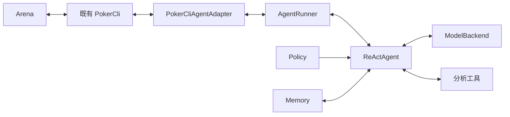

# ReAct Agent：以 LLM loop 为核心的玩家对象

本包实现正式的 Agent 对象：每次牌局决策至少请求一次 `ModelBackend`，模型可以请求分析工具，程序执行后把结果送回模型，直到模型给出合法最终动作。`Policy` 决定如何引导和约束这个过程。Arena 接入仍使用已有 CLI；下注提交、过期检查和真实确认由原运行时负责。

项目需求和验收总入口见[仓库 README](../../../../README.md)；之前的 `decide → Decision` 接口现在命名为 `DecisionEngine`，供运行时及机械基线使用，旧 `poker.agent.policy.Policy` 保留兼容别名。正式策略应从 `poker.agent.react.policy` 导入 `Policy`。

## 1. 对象及所有权



一个玩家对应一个独立 Agent 进程。`AgentRunner` 管理 CLI 生命周期、观察更新、决策工作线程、取消、动作提交及确认。`ReActAgent` 拥有模型调用循环及其会话预算；后端拥有自己发起的网络请求或推理子进程。所有 Arena 观察来自 `PokerCliAgentAdapter` 返回的本人安全视图，模型、Policy、分析工具都没有 Arena 提交通道。

ReAct 名称取自[原论文](https://arxiv.org/abs/2210.03629)中交替使用推理和环境反馈的思路。本项目实现可观测的“请求模型 → 请求工具 → 回传工具结果 → 最终动作”循环，不要求模型输出或保存私有思维过程，也不声称复现论文的实验成绩。

## 2. 三个核心契约

| 接口 | 输入 | 输出 | 负责的事情 |
|---|---|---|---|
| `Policy.guidance(PolicyRequest)` | 当前玩家观察、记忆快照、当前决策的工具交换记录、轮次 | `Guidance` | 指导内容、数据上下文、允许工具、必须完成的分析步骤 |
| `ModelBackend.generate(BackendRequest, DecisionControl)` | 指令、JSON 数据、输出 schema、输出长度目标；取消与剩余时间 | `BackendResponse` | 一次推理；返回 JSON、用量、请求标识、结束原因 |
| `ReActAgent.decide(DecisionRequest, DecisionContext)` | 运行时的安全观察及绑定该观察的工具能力 | 最终 `Decision` | 构造上下文、调用模型、执行工具、核对 Policy 约束、验证最终动作 |

`Policy` 不需要知道模型通过 HTTP API 还是 Codex 登录调用。`ModelBackend` 不需要理解扑克字段，不执行模型输出的工具请求。模型给出的最终动作进入 `AgentRunner` 后，仍需经过 CLI 刷新及服务端 revision 校验，才可能得到成功确认。

## 3. Policy 为什么不只是 Markdown

`PolicyRequest` 包含 `decision`、`memory`、`exchanges`、`round_index`。每轮模型调用前都会重新求 `guidance()`，所以 Policy 能根据已获得的证据改变下一步要求。可变 JSON 和工具记录会复制，避免插件改写历史记录。

```python
class Policy(ABC):
    @abstractmethod
    def guidance(self, request: PolicyRequest) -> Guidance:
        ...

@dataclass(frozen=True)
class Guidance:
    instructions: str
    context: JsonObject
    allowed_tools: tuple[str, ...] | None
    required_tools: tuple[str, ...]
    required_after: int
```

`instructions` 是自然语言指导；`context` 可以携带范围表、权重、阶段标签、外部训练得到的参数等 JSON 数据。`allowed_tools=None` 表示本轮可使用已安装的所有分析工具，空元组表示一个也不允许。`required_tools` 由程序检查是否真正成功调用，失败的工具结果不能满足要求。`required_after` 指定工具交换记录的起始索引，确保新阶段使用新的分析结果。

同一次牌局决策中，已经提出的工具要求累计保留。之后的 Policy 不能通过移除字段撤销尚未完成的要求。模型提前给出最终动作时，程序不会提交该动作，而是回传缺少哪些分析的反馈，继续下一轮；所有轮次都计入调用预算。

自然语言本身仍是软指导。例如“偏保守”“更重视位置”是否被模型遵守，需要单独评测；工具允许列表、成功证据、顺序、预算和动作合法性则由代码执行。新的硬约束应明确增加类型及验证逻辑，不能靠一句提示词冒充已经实现的保证。

内置三种 Policy 实现：

- `TextPolicy`：固定自然语言和可选结构化背景。工厂可以读取 Markdown 文件，文本进入同一接口。
- `StructuredPolicy`：根据观察计算上下文及分析要求，例如面对下注时要求先估算 equity。
- `WorkflowPolicy`：依次完成指定阶段；提前调用后续阶段的工具不算完成后续阶段，同名工具在两个阶段出现时也必须重新调用。

以下 Policy 可以直接与任意后端组合：

```python
from pathlib import Path
from poker.agent.react.policy import TextPolicy, WorkflowPolicy, WorkflowStage

text_policy = TextPolicy(
    Path("policy.md").read_text(encoding="utf-8"),
    allowed_tools=("legal_actions", "equity"),
    required_tools=("legal_actions",),
)

workflow = WorkflowPolicy((
    WorkflowStage("observe", "阅读当前合法动作和公开历史。",
                  ("legal_actions", "public_history")),
    WorkflowStage("analyse", "结合历史估算 equity，再评估跟注价格。", ("equity",)),
    WorkflowStage("decide", "根据已有证据选择一个合法动作。"),
), allowed_tools=("legal_actions", "public_history", "equity"))
```

Python Policy 是受信任本地插件，可自行持有复杂对象。接口限制的是组件之间交付的内容，不构成操作系统沙箱。

## 4. ModelBackend 的最小职责及扩展

`BackendRequest` 有 `instructions`、`input`、`output_schema`、`max_output_tokens`；`BackendResponse` 有 `output`、`usage`、`request_id`、`finish_reason`。`BackendIdentity` 明确 provider、model、`is_live`。`BackendUsage` 中未知输入、输出、缓存 token 和费用均为 `None`。新后端只需实现 `identity` 和 `generate()`，有资源时实现 `close()`。

后端收到的工具调用只是输出 JSON。应用协议有两种响应：

```json
{"kind":"tool_calls","calls":[{"id":"read-1","name":"legal_actions","arguments":{}}],"action":null}
```

```json
{"kind":"final","calls":[],"action":{"kind":"check","to":null}}
```

工具调用 ID 在一个决策内必须唯一。调用参数经工具自己的 schema 验证，工具输出带成功或错误标记。最终动作只允许服务端提供的选择；`bet_to` / `raise_to` 的 `to` 表示本街累计投入。当前正式 ReAct 协议要求模型返回一个具体动作；需要混合策略时，可以由模型决定采样后的具体动作或以后扩展正式协议。底层 `DecisionEngine` 的基线接口仍支持有限动作分布。

| 后端 | 实现情况 | 限制 |
|---|---|---|
| `CodexBackend` | 复用本机 Codex 登录，每次推理建立独立临时调用；显式选择模型，关闭环境工具及用户工作区配置 | 当前不复用对话 Session；输出 token 目标无法作为 CLI 硬限制；CLI 内部可能有传输重试 |
| `ChatCompletionsBackend` | 一次 HTTP POST，使用 JSON Schema 输出和 `max_completion_tokens`；Key 仅从显式环境变量读取 | 要求服务端支持相应协议和 schema；没有自动重试、重定向或降级 |
| `FixtureBackend` | 确定性测试对象，经过相同 Agent 循环 | `is_live=False`；不调用 LLM，不检验自然语言理解能力 |
| `LocalHttpFixtureBackend` | 使用生产 HTTP 适配器连接本机模拟服务 | `is_live=False`；检验 HTTP 链路，不代表外部模型服务可用 |

两个实际服务后端都要求显式 `model`，没有昂贵的隐式默认模型。Codex 命令及结构化输出依据[官方非交互文档](https://learn.chatgpt.com/docs/non-interactive-mode)；HTTP 输出约束依据[官方 Structured Outputs 文档](https://developers.openai.com/api/docs/guides/structured-outputs)。内置工具使用封闭对象及 `anyOf` 表达可选形态，以满足每个对象全部字段必填的服务端要求；自定义 schema 在调用前检查这项限制，复杂 JSON Schema 仍须满足所选服务端支持的子集。

后续接入持久 Codex Session、Responses API、本地推理服务时，可以新增同一接口的实现。Session 上下文如何存储和复用属于后端实现，扑克策略与工具执行循环仍由本项目持有。

## 5. 工具、记忆、预算和失败

标准分析工具 `observation`、`legal_actions`、`public_history` 读取本次决策冻结的安全视图。示例增加 `lookup` 和 `equity`：前者返回简单查表建议，后者做少量 Monte Carlo 估算。equity 示例假设未知对手牌均匀分布，不推断范围、不考虑后续下注或弃牌率、不处理边池权益；全下 EV 返回未知。它们只能提供分析材料，最终动作必须由模型返回。

`Memory.read(observation)` 为新决策提供快照，`Memory.observe(event)` 接收运行时事件。`BoundedEventMemory` 默认保留最近 64 个真实动作反馈或完成手结果，区分确认与拒绝；不会把模型提出但未确认的动作写成已执行，也不会把首次观察中的旧结果补造成新奖励。去重范围与保留窗口一致；当前是进程内记忆，不自动持久化。

默认预算是每个决策最多 6 次模型请求、每个 Agent 会话最多 32 次，输入 65536 字节、输出 65536 字节，单次输出目标 512 token，分析工具每个决策最多 8 次。失败或执行结果未知的模型调用也消耗一次尝试预算。没有自动增加预算或改用随机动作的机制。单个进程预算不等于六进程共同费用上限；整个实验的总预算必须由实验管理器汇总。

Codex 调用取消或到期时终止并回收其直接子进程；HTTP 的 DNS 等待、连接、TLS、发送、读头与读体均有取消边界。DNS 的系统解析线程可能短暂继续，但不能在取消后再发 HTTP 请求。任意第三方 Python Policy/Tool 仍需配合取消，原 Runner 的 watchdog 拒绝迟到决策并如实记录未退出 worker。

模型返回的非法 JSON、越界动作、未知工具、预算耗尽和后端失败会结束此次运行，不会隐式替换打法。CLI 提交后只有收到对应成功回复才算确认；超时或断开造成的未知执行结果不自动重发。

日志只记录关联标识、调用次数、成功状态和已知用量，不写提示词、私牌或工具正文。已完成响应在取消到达时被丢弃，已知 usage 仍保留：后端在交付前取消的用量保存在 `api.call.completed`，loop 已收到的用量还计入 Agent 汇总。Agent 汇总因此可能是部分用量；不能把 `None` 或缺失账单解释为零费用，也不能据此声称有硬金额上限。

## 6. 运行及复现

在本 worktree 安装后，命令入口是 `poker-react-agent`，也可以运行 `python -m poker.agent.react`。后端与 Policy 都通过 `module:factory` 显式注入，配置 JSON 交给受信任工厂，完整配置不写日志。

下列两条命令各自启动正式 Arena 和六个独立 Agent，使用不同模型替身验证同一套 Policy：

```powershell
.\.venv\Scripts\python.exe -X utf8 scripts/verify_react_agents.py `
  --output-dir .data/react-fixture-new --backend fixture --hands 2 --timeout 180
.\.venv\Scripts\python.exe -X utf8 scripts/verify_react_agents.py `
  --output-dir .data/react-http-new --backend http-fixture --hands 2 --timeout 180
```

每次使用不存在的新输出目录。六个 Policy factory 为 `text`、`rules`、`lookup`、`memory`、`solver`、`combined`，位于 `poker.agent.react.examples`。它们都经过模型接口；测试替身只用来检验循环和链路。真实服务可换用 `codex_backend` 或 `chat_completions_backend` 工厂。

手动接入已有 Arena 的真实 Codex Agent：先创建 `.data/react-config.json`，填入当前账号支持且已核实成本的模型标识：

```json
{"model":"REPLACE_WITH_EXPLICIT_VERIFIED_MODEL","instructions":"参考合法动作，选择一个动作。"}
```

```powershell
.\.venv\Scripts\poker-react-agent.exe --port 8765 --name TextAgent `
  --backend poker.agent.react.examples:codex_backend `
  --policy poker.agent.react.examples:text --config .data/react-config.json `
  --max-model-calls-per-session 8 --max-model-calls-per-decision 4 `
  --decision-timeout 60 --session-timeout 300
```

该配置中的模型名是需替换的占位符；仓库没有把它当作可运行默认值。选择 HTTP 工厂时，配置还必须包含 `base_url` 和 `api_key_env`，真正 Key 放在对应进程环境变量中。使用 `memory` 或 `combined` 时增加 `--memory-factory poker.agent.react.examples:event_memory`；需要查表或 equity 时增加 `--tool-factory poker.agent.react.examples:analysis_tools`。

验收驱动逐条核对 CLI 请求、revision、服务端快照、私牌隔离、公开历史、确认动作、6000 筹码及 52 张牌守恒，重开 SQLite，并把模型请求与工具和决策关联。回执保留全部七个游戏进程的退出码、运行前后源文件哈希、原始证据哈希。HTTP 场景还核对 POST 次数与模型调用次数一致。

这轮 R01 交付证明新循环、后端接口和 Arena/CLI 链路跑通。新 Codex/HTTP 外部 provider 的真实推理验收尚未运行；之前 A02 及原目录夜间任务使用旧接口，其真实模型证据单独保留。策略强弱、胜率和长期费用不属于本次结论。
